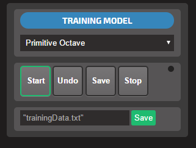
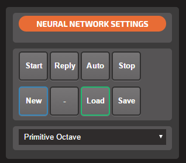
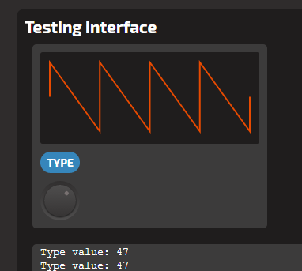

Project 2 - opvolgingsdocument Academiejaar 2016-2017
=====================================================

### Student:	Rafaël Mindreau

### Mentor:		Joris Maervoet

## Beschrijving
#### @rafael.mindreau - 23/09/2016

#### Onderwerp:

> Een VST/Instrument schrijven in JUCE (C++ Framework) die MIDI input van de gebruiker leest, en daarop verder kan improviseren.
> De gebruiker speelt bij voorkeur op een externe MIDI controller (reeds voorzien) een aantal akkoorden. De plugin leest de noten,
> improviseert er verder op a.d.h.v. een reeks vooringestelde parameters, en sluist het door als MIDI output. Men kan bij het gewenste
> instrument (waar MIDI omgezet wordt naar geluid) kiezen voor de MIDI input van de plugin.

#### Einddoelen:

1. De student ontwikkelt een VST/Audio-testapplicatie met Juce in C++. De toepassing kan MIDI-input verwerken en terug uitvoeren.
2. De student ontwikkelt een proof-of-concept VST/Audio-toepassing met Juce in C++. Deze A.I.-toepassing luistert naar een sequentie noten via MIDI input en gebruikt een neuraal netwerk om op basis van een aantal parameters verder te improviseren op de muzikale compositie, en voegt deze MIDI output samenvoegen met de input.
3. Hij maakt in een kort rapport een kritische evaluatie van de uitgewerkte demonstrator en kadert future work.

#### Motivatie - betrokkenheid:

```
Ik ben begeesterd door de muziek en al zijn facetten. Ik experimenteer vaak met nieuwe vormen. Instrumenten kunnen schrijven is een mooie volgende stap.
```

#### Motivatie - grenzen verleggen:

```
C++ is en blijft een serieuze uitdaging. Een artificiële intelligentie schrijven lijkt mij een zéér interessant onderwerp waarin ik ook verder wilde groeien.
```

#### Motivatie - professioneel profiel:

```
Verschillende facetten van dit project kunnen mij later in mijn voordeel pleiten. C++, VST's ontwikkelen, en zelfs AI.
```

#### Kerndoelen:

> 1.a, 2.a, 2.b, 6.e, 8.i, 8.j, 10.n

#### Werkvormen:

* De **Tutorials** op de website van https://www.juce.com/ volgen om tot een succesvolle eerste applicatie te komen.
* Uitwerken hoe er binnen het JUCE framework, of binnen VST3 (Steinberg) **met MIDI kan gewerkt worden.**
* C++ bij schaven waar het nodig is met **http://www.cplusplus.com/doc/tutorial/**.
* Onderzoeken hoe **neurale netwerken** gebruikt kunnen worden voor de improvisatie van muziek.
* Onderzoeken hoe deze neurale netwerken te laten werken **waar het tijdsdomein van belang is**
* Neurale netwerken gebruiken binnen de demonstrator.
* Grondig **rapporteren** hoe de implementatie van **algoritmen, en neurale netwerken** in de toepassingen verliepen.

<!--
#### @joris.maervoet - <28/09/2016>
> Rafael, een topvoorstel! En bovendien heb je niet zoveel werk meer aan de beschrijving.
> Alleen moet je je einddoelen één voor één nog eens afchecken of ze concreet en meetbaar (voor ons) zijn. Voor alle duidelijkheid: de einddoelen zijn de realisaties 
> waar wij je aan het einde van de rit op zullen evalueren. Niet alle (studie-)activiteiten hoeven noodzakelijk in de einddoelen verwerkt te zitten. Een voorbeeld:
>  - de student maakt een proof-of-concept VST/Audio-toepassing met JUCE in C++. Deze toepassing leest de noten die binnenkomen via een externe MIDI controller, transponeert ze en sluist ze door naar een MIDI-output.
>  - de student maakt een rapport van de mogelijke A.I.-technieken die kunnen gebruikt worden voor het vervolledigen van of het verder improviseren op een muzikale compositie. Hij maakt een inschatting hoe de technieken kunnen worden ingezet voor polyfonie en bij online/offline leren.
>  - de student maakt een demonstrator met JUCE die ... ... ... (werk af en wees concreet).
>  - de student maakt in een kort rapport een kritische evaluatie van de uitgewerkte demonstrator en kadert future work
>
> Probeer bij de werkvormen zo volledig mogelijk te zijn: hoe ga je C++ leren? Misschien kan je je huidige einddoelen 2/3/4 ook verhuizen naar de werkvormen. 
>
> ps: wat betreft de A.I.-setup is het me nog niet duidelijk of de gebruiker volledig stopt met spelen, of of hij nog verder doet tijdens of na de improvisatie door de computer - dit maakt algoritmisch-technisch weldegelijk een verschil
>
> pps: ik stuur je al wat info via e-mail

#### @rafael.mindreau - <29/09/2016>
> Beste meneer Maervoet, 
> 
> Je merkt ook vast wel dat dit document plotseling de README.md is geworden, en dat onze ogen nu in de zachtheid van Markdown mogen vallen. Hopelijk vind je dit OK.
> 
> Ik heb uw e-mail goed ontvangen, en ben zeer tevreden met het duwtje in de juiste richting! Ik wist eerst niet goed hoe ik de AI zou uitwerken, maar nu je met neurale netwerken kwam zag ik het beeld opklaren. Ik heb getracht om de einddoelen zo veel mogelijk te concretiseren, maar omdat ik er nog zo weinig van afweet is dat tricky. Bij de werkvormen heb ik genoteerd wat er bij elke speciefiek is en dus concreet naar gewerkt moet worden.
> 
> C++ leren is niet zo evident. Zeker tegenwoordig. We zijn tegenwoordig als jongeren zo gewend aan higher level languages. Gelukkig ben ik al een paar jaar zo hier en daar wat bezig geweest met classic C++, in de mate dat ik pointers volledig versta, en kan gebruiken. Ik ben het al wat gewend van bij te leren via tutorials. Ik heb geprobeerd met boeken maar, wel het is vooral te wijten aan een conditie in mijn ogen die boeken lezen onnoemelijk ambetant maakt, maar het heeft ook te maken met de langdradigheid en volledigheid van boeken die mij langs de kant slingeren in no-time. Memory management op schaal van iets grotere applicaties heb ik nog nooit gedaan. Ik weet dat memory leaks de n°1 enemy zijn in C++, en weet hoe ik ze moet vermijden (deconstructors schrijven en delete gebruiken, althans op heap). Maar ik ben het heel zeker dat ik nog veel moet bijleren in C++, over de dingen die ik hier nog niet heb opgesomd wel te verstaan. Omdat ik met een framework moet werken wil ik mij gezien de tijd enkel beperken tot wat zeker nodig is.
> 
> Wat betreft neurale netwerken ben ik enorm "excited" als je zegt dat deze out-of-the-box kunnen worden gebruikt. Ik had inderdaad al een paar libraries gevonden op het net voor C++ specifiek. Ik ga inderdaad in het tijdsdomein iets moeten verzinnen als een soort ven schedueling voor deze rap te doen reageren op zo'n optimaal mogelijk niveau. Ergens dacht ik ook nog om GPU computing te gebruiken met OpenCL maar dan kan ik evengoed een UFO gaan bouwen, ik denk dat ik het realistisch ga moeten houden.

#### @joris.maervoet - <03/10/2016>
> Rafael, je bent er echt bijna.
> - Als een einddoel echt een complex systeem beschrijft, splits je het beter op in (chronologische) deelstappen. Dat heb jij ook proberen doen, maar je einddoel 1 is al heel jouw systeem. Einddoel 3 en 4 zijn in feite hetzelfde. Vandaar mijn voorstel hierboven (feedback 28/09/2016) om einddoelen te formuleren die stapje voor stapje het systeem opbouwen: (1) JUCE verkennen en aan MIDI hangen, (2) studie A.I. technieken (3) integratie A.I. techniek (4) kort rapport. Doe jij nog eens een poging?
> - "De gebruiker kan nog steeds spelen, waardoor de AI rap moet kunnen inspelen op veranderingen." -> misschien moet je de lat voor jezelf niet zo hoog leggen en dit weglaten?
> - einddoel 6 is niet toetsbaar en mag inderdaad weg. Maak je maar niet teveel zorgen over C++. Het is een trouwens een taal die je toelaat high level en low level te programmeren - dus het kan in JUCE nog alle kanten op.
> - schrijf je nog bij de werkvorm dat je een neuraal netwerk zal kiezen en integreren in je demonstrator?
>
> Als dit in orde is, keur ik goed.
>
> ps: UFOs hoef je inderdaad niet te bouwen
>
> pps: het zou kunnen dat je je testen aanvankelijk zuiver melodisch start en dat je pas daarna ritme toevoegt als een nieuwe dimensie, maar dat zijn zorgen voor later

#### @joris.maervoet - <05/10/2016>
> Rafael, aiai je einddoelen zijn niet meer concreet+toetsbaar !!!
> Kan je misschien gewoon volgende einddoelen overnemen? Dan keur ik het goed.
>   1. De student ontwikkelt een VST/Audio-testapplicatie met Juce in C++. De toepassing kan MIDI-input verwerken en terug uitvoeren.
>   2. De student ontwikkelt een proof-of-concept VST/Audio-toepassing met Juce in C++. Deze A.I.-toepassing luistert naar een sequentie noten via MIDI input en gebruikt een neuraal netwerk om op basis van een aantal parameters verder te improviseren op de muzikale compositie, en voegt deze MIDI output samenvoegen met de input.
>   3. Hij maakt in een kort rapport een kritische evaluatie van de uitgewerkte demonstrator en kadert future work.
-->

#### @joris.maervoet - <06/10/2016>
> goedgekeurd

Planning - <08/10/2016> (op te stellen nadat je voorstel is goedgekeurd)
-------------------------------------------------------------------------------------

https://docs.google.com/spreadsheets/d/1XgQruoB_ySyDcglsJhUwQYiG0AE8MQ-1FZjhBDiEDrQ/edit?usp=sharing

```
Voor de planning word gebruik gemaakt van google sheets. De planning is daar overzichtelijker dan het te proberen gieten in een tabel in markdown of text. Commentaar kan worden toegevoegd, maar indien het vereist is kan full permission met een link doorgegeven worden (don't share it with other students)
```

Logboek
-------

> Noteer hier je activiteiten, gevonden informatie, behaalde milestones, 
> belangrijke gebeurtenissen, problemen, oplossingen...
> Zet voor elke nieuwe entry op een aparte lijn je naam en de datum.
> Als je dat wil, mag je de zuiver technische informatie in een aanvullend 'technisch logboek'
> bijhouden (binnen je repository). In dat geval kan je hier bij de verschillende entries verwijzen
> naar dat technisch logboek.

| Datum    | Activiteit       |
| -------- | ---------------- |
| 09/10    | Juce Test-applicatie aangemaakt, hello world werkt, apparaten kunnen worden weergegeven en geselecteerd. MIDI messages worden doorgegeven. Het proces ging niet zo heel moeizaam ondanks C++. JUCE is vrij High-level. De tutorials van op de site compileerden niet meer, wat mij forceerde diep in te gaan op de code-voorbeelden. De Hello World die geschreven werd heeft een combo-box die de apparaten oplijst met MidiInput::getDevices(). Om de messages van de MIDI toestellen op het scherm te krijgen was wat meer handwerk nodig. Deze kwamen van een OS-thread die in een soort message pump naar de GUI moesten worden gebracht. Voor de rest lijkt JUCE mij het ideale framework! Veel tijd uitgespaard! |
| 13/10    | Het 88-toetsen keyboard laat het van zich afweten. Dit maakt development tests in het basregister moeilijk met het 49-toetsen keyboard dat mij nog rest... |
| 13/10    | Aanmaak van de Transpose-Test is gebeurd. Deze test toetst het aanmaken van custom Midi Messages in conjunctie met bestaande input van een extern keyboard. De bedoeling is om met een slider de stap tussen de gespeelde noot te maken. Seconde, terts, tot en met octaaf. Om dit goed weer te geven zal de output voorlopig als sinusgolf binnen de applicatie blijven. Complicaties liggen op mijn weg om de MIDI door te voeren naar een andere applicatie. Het zou in de toekomst slim zijn om een debug checkbox toe te voegen die de MIDI als sinusgolven zal weergeven. De test is nog niet af. |
| 18/10    | Afwerking van de Transpose-Test. De applicatie gebruikt uiteindelijk een on-board midi keyboard component in plaats van de eerder geplande sinusgolven (dewelke het eerder moeilijker maakten). Let wel op dat enkel input van externe instrumenten worden getransponeerd en weergegeven in de GUI. Je kan ook drukken op toetsen in de GUI, maar deze worden niet getransponeerd. Met een slider kan je kiezen hoeveel semi-tonen je transponeert.  |
| 13/11    | Duidelijk is het feit dat leren werken en omgaan met Neurale Netwerken niet eenvoudig is. Het nam meer tijd in beslag dan verwacht, en voor deze reden zitten we niet meer op schema. OpenNN blijft de enigste C++ implementatie van neurale netwerken die beschikbaar is. De library werd gedownload, en de documentatie werd grondig bestudeerd.  |
| 22/11    | De pogingen om OpenNN te laten meedraaien in het JUCE framework zijn tevergeefs. JUCE wordt door zijn eigen PROJUCER als project gemaakt per IDE. Bij OpenNN komen een aantal CMAKE files (niet gelijk aan linux make-file). Ik heb geprobeerd na te gaan hoe ik de projecten kan consolideren, maar de PROJUCER vindt het helemaal niet leuk wanneer men achter de schermen aan de dependencies prutst. Ik kon OpenNN appart builden en heb geprobeerd de static libraries te linken in de JUCE projecten, maar zonder veel effect. Ik kan beginnen onderzoeken hoe dit alles komt, maar ik voel dat ik hieraan héél véél tijd verlies, wanneer ik eigenlijk echt gewoon wilde focussen op het project zelf. |
| 24/11    | Na goedkeuring van de begeleidende docent ben ik overgestapt naar een andere taal/library. Binnen JavaScript biedt Synaptic.js zelfs een beter en simpeler + beter gedocumenteerde library voor neurale netwerken. Deze keer wél met expliciet een support voor LSTMs. Hier zat ik op te wachten! Het MIDI-probleem kan van JUCE makkelijk overgeschakeld worden naar Web API in Google Chrome, waar MIDI gewoon in de browser werkt. Dit wist ik niet, en had ik dit geweten, dan had ik dit eerst gekozen. Omdat mijn JavaScript vele malen beter is dan C++, en omdat het moderner is. Zonder al te veel moeite.  |
| 9/12    | Om te kunnen werken met een NN is training-data vereist. Hiervoor is dus redelijk wat tijd genomen geweest om de ingave ervan te vergemakkelijken. In dit eerste data-model: "Primitive Octave" wordt uitgegaan van een serie van 12 noten. Dit worden de 12 input nodes. Er moet dus een base note geselecteerd worden om de conversie van 88 toetsen naar 12 te gaan. De base note + 12 is de range waarin mag worden gewerkt. Het verzamelen van deze data gebeurt iteratief. Door een input node, en de verwachte volgende noot achter elkaar te spelen. De Data Collector module in de test-app zorgt hier dus voor een gemakkelijke ingave.  |
| 20/12    | Een doorbraak! Vandaag de eerste outputs kunnen krijgen in klankvorm voor de Primitive Octave methode. Ik kan nu verschillende training-sets testen om te zien wat hun effecten zijn op de output. De volgende stap is om de 8-fingered optimized methode uit te werken. Voor 88-key polyphony is er geen tijd. Bovendien heb ik een sterk vermoeden dat dit te veel zal zijn omdat deze methode werkt met 88 input nodes. De interface draagt zijn steentje bij om het testen te vergemakkelijken. Het ziet er intimiderend uit, maar om die reden zal er documentatie voorzien worden.  |

Tussentijdse rapportering #1
---------------------------
#### Stand van zaken
> JUCE framework was de entry-point voor dit project. De werking ervan moest worden geleerd. Uiteindelijk is JUCE een vrij High-Level Framework in C++ met tal van gelijkenissen met eender welke andere bekende UI zoals winforms, of Java Swing. De werking is vrij robuust, en de API is zéér transparant geschreven.

> Eerst moest een hello world applicatie geschreven worden. Direct met GUI. Aangezien PROJUCER dit direct genereert was er weinig aan te vervolledigen. Daarna werd een helloWorldMidi geschreven. Doel van de test was om de GUI controls te gebruiken, en gewend te geraken, alsook leren omgaan met Midi Messages. Hier kwamen er al complexe problemen m.b.t. thread safety en het pompen van messages naar een GUI thread, zoals gezien was in C#.

> Daarna werd een test gedraaid om te zien hoe nieuwe Midi Messages konden worden aangemaakt. De user input moest worden getransponeerd en toegevoegd aan het originele signaal. Ook deze test was met succes afgewerkt.

> Sedert de afgelopen week is weinig vooruitgang gemaakt. Althans blijkt dit in eerste instantie zo. De waarheid is dat er een heuvel het project belemmert, waarover ik heen moet. Het neurale netwerk, of eerder de implementatie van het probleem binnen neurale netwerken. Hier zijn nog steeds bedenkingen over. Het is belangrijk om zich hier in deze stap niet te vergissen i.f.v. tijdsbesteding.

#### Reflectie
> De planning is realistisch ingeschat. De eerste taken waren veel rapper dan verwacht uitgevoerd. Dit zorgde voor een voorsprong in de planning. Echter trekt het AI-struikelblok dit voordeel terug weg. Na de herfstvakantie moet er een concrete visie op tafel gelegd worden, en dat kan nog al eens 'pikant' worden.

> JUCE is een interessant framework. De keuze is goed gemaakt om hiermee aan de slag te gaan. Echter lijkt meer en meer de keuze om het met neuraal netwerk te werken een moeilijk en uitdagend onderwerp. Dit mag niet worden onderschat.

> Als er geen concreet ontwerp op de tafel kan worden gelegd, of voldoende inzicht verworven word in een te gebruiken netwerk, dan spreken we van een probleem, en daar heeft de planning ook weinig rekening mee gehouden.

#### Evaluatie
| Topic    | Zelf-evaluatie       |
| -------- | -------------------- |
| **Nieuw verworven kennis** | C |
| **Toepassing aangetoond** | C |
| **Planning** | A |
| **Analyse node** | B |
| **Initiatief - inzet** | B |
| **Rapportering** | C |

#### @joris.maervoet - <26/11/2016>
> Rafaël,
> Je tussenrapportering van 28/10 (aangevuld 2/11) is okee. De stand van zaken is duidelijk, je reflectie is min of meer okee en je scores van de zelfevaluatie kloppen. 
> Je planning is zeer verzorgd en je logboek leest als proza maar dat hoeft niet; het mogen ook korte opsommingen zijn.
> Ondertussen hebben we al 2 keer samengezeten/overlegd en is er al heel wat veranderd - vandaar dat het voorlopig niet veel zin meer heeft om nog inhoudelijke feedback te geven op je tussenrapportering (TBC ...).

Tussentijdse rapportering #2
---------------------------
#### Stand van zaken
> De afgelopen weken zijn qua vooruitgang een absolute ramp geweest. Dit wegens het samenvallen van de deadlines van andere vakken. Gelukkig is de theorie van Neurale Netwerken langzamerhand door de voegen van mijn hersenmassa aan het sijpelen. Het begint duidelijker te worden wat nodig is om tot een resultaat te komen.

> Er is een serieus probleem met de opstelling. C++ JUCE, en OpenNN werken niet graag samen. Waarschijnlijk te wijten aan mijn tekort aan ervaring in C++ projectstructuren. C++ is een standaard, waarvan er een heleboel implementaties bestaan. Dit maakt het niet gemakkelijk. Zo was een hele tijd de term 'make-files' verward geraakt met 'Cmake'. Dit zijn compleet verschillende begrippen. Cmake hielp mij uiteindelijk om OpenNN te kunnen builden. Ondanks de slechte documentatie over het builden van de source van OpenNN, ben ik tot op heden niet zeker of het wel de juiste keuze was om het te builden met Cmake. Cmake maakte voor mij een projectstructuur voor Visual Studio 2015. Terwijl make-files eigenlijk enkel op Linux te bespreken zijn. Daar ik van plan was te werken met Ableton LIVE en VST3 om mijn applicatie te draaien, viel Linux buiten de kwestie.

> Om dan JUCE, met zijn eigen projectstructuur gemaakt in PROJUCER, waar de eigenlijke instellingen verborgen blijven van de ontwikkelaar, te laten samen werken met OpenNN... Dit was een taak waarvan het gewicht niet meer op ging i.f.v. de tijd die mij nog restte. Er is dus een beslissing gekomen om te werken met Synaptic.js. Een JavaScript Library die mij toevallig voor de ogen kwam dansen op een goede zondagavond. Deze library biedt **meer mogelijkheden i.v.m. OpenNN!!!**. Een kleine test met Midi in de browser, en werken met oscillatoren hadden het idee aan mij verkocht. Dit zal het worden.

> Omdat ik niet veel tijd meer heb, moet ik mij focussen op onderzoek. Ik wilde graag een aantal technieken onderzoeken, waaronder RNN met LSTM. Vergelijking met 88 input nodes tov glijdende schaal. Ook had ik nog een techniek met 8 input nodes, omdat men meestal de piano bespeelt met max 8 vingers. Hoewel ik stukken heb gespeeld met 6 vingers op 1 hand, maar ik wil het eerst simpel houden.

#### Reflectie

> We lopen heel serieus achter, dus de planning blijft wel geldig, maar de naleving ervan is pijnlijk. Met spijt in het hart moet ik het hoog gegrepen doel in de kast steken. Ik zal mij voortaan focussen op onderzoek. Deze keuze is op zich zeker niet slecht gezien de tijd me nog rest, en het begrip voor realisme.

> Er is dankzij Synaptic.js veel nieuw verworven kennis. Backpropagation, activatie, structuur, training methods, ... 

> Er wordt nu stevig gewerkt aan een test-interface waarin ik rap een oscillator bouw met wat instellingen. Het trainen kan starten zodra midi verboden is aan deze oscillator.



#### Evaluatie
| Topic    | Zelf-evaluatie       |
| -------- | -------------------- |
| **Nieuw verworven kennis** | B |
| **Toepassing aangetoond** | C |
| **Planning** | A |
| **Analyse noden** | A |
| **Initiatief - inzet** | B |
| **Rapportering** | B |
